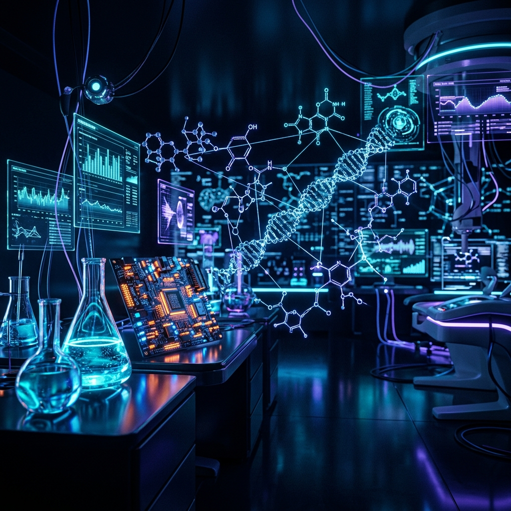
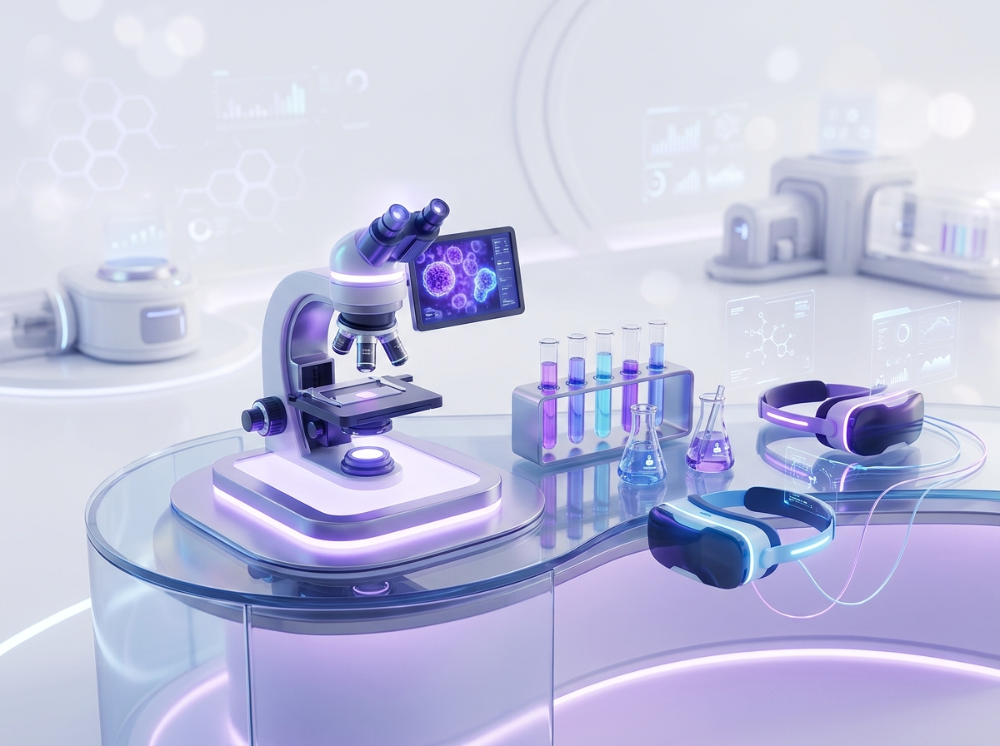
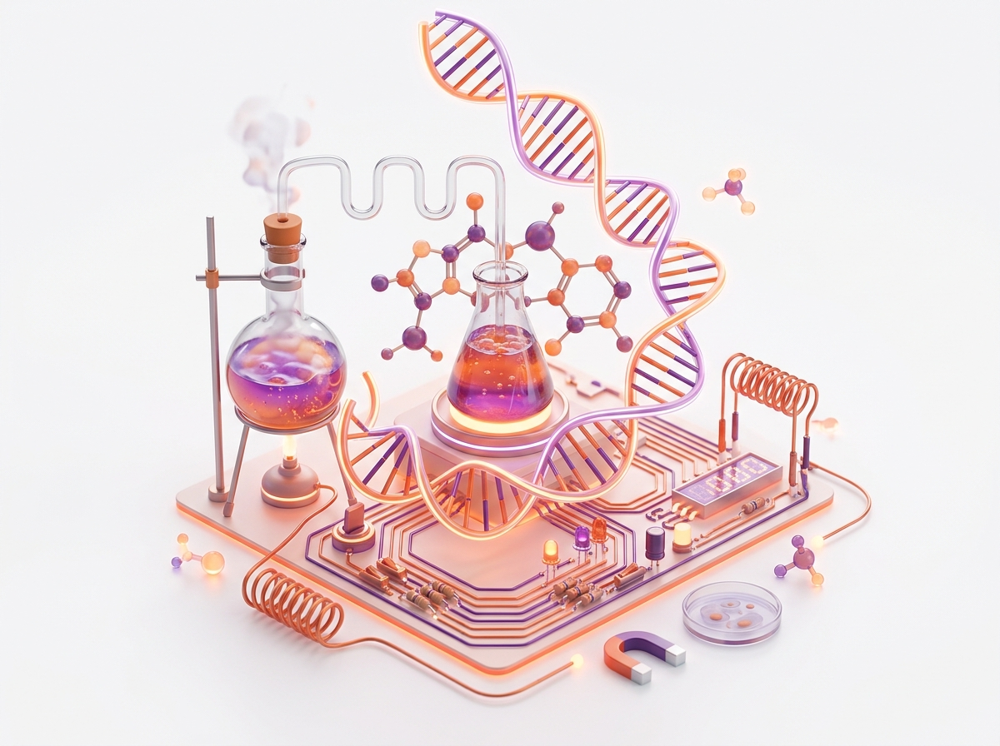

# 🧪 VirtuLab

**Reimagining Science Education Through AI & Interactive 3D Laboratories**



VirtuLab is a next-generation AI-powered virtual laboratory that transforms STEM education through immersive 3D simulations. Perform realistic chemistry and physics experiments, receive intelligent AI guidance, generate instant lab reports, and develop practical skills in a safe, browser-based environment—anytime, anywhere.

---

## ✨ Key Features

- 🔬 **Immersive 3D Labs**: Walk through fully rendered virtual laboratories in your browser. Perform experiments using realistic 3D equipment without the need for expensive physical infrastructure.
- 🤖 **AI-Powered Assessment**: Get instant AI reports grading your experiment technique, accuracy, and flow. Our built-in AI mentor guides you step-by-step and provides personalized feedback.
- 👨‍🏫 **Teacher & Student Portals**: 
  - **Teachers** can create virtual classrooms, monitor live student progress, and access detailed AI analytics.
  - **Students** can join classrooms using codes, perform assignments, and track their own performance.
- 📊 **Analytics Dashboard**: Real-time performance charts, score distributions, and AI insights for educators to identify areas where students need the most help.
- 🌐 **Multi-Domain Experiments**: From Chemistry (Acid-Base Titration, Flame Tests, Iodine Clock) to Physics (Simple Pendulums, Circuit Building, Projectile Motion).
- 🛡️ **Safe & Accessible**: No dangerous chemicals, no broken beakers. Every student gets unlimited lab access in a secure, risk-free environment.

---

## 💻 Tech Stack

VirtuLab is built using modern, performant web technologies:

- **Frontend**: React 19, Vite
- **3D Engine**: Three.js, React Three Fiber, React Three Drei
- **State Management**: Zustand
- **Animations & Styling**: Framer Motion, Vanilla CSS (Custom modern UI system)
- **Icons**: Lucide React
- **Backend & Auth**: Supabase (PostgreSQL, Authentication)

---

## 🚀 Getting Started

Follow these instructions to set up the project locally on your machine.

### Prerequisites
- Node.js (v18 or higher)
- npm or yarn

### Installation

1. **Clone the repository:**
   ```bash
   git clone https://github.com/Sasitharan06/InnoVex-Zeai-project.git
   cd InnoVex-Zeai-project
   ```

2. **Install dependencies:**
   ```bash
   npm install
   ```

3. **Environment Variables:**
   Create a `.env` file in the root directory and add your Supabase credentials:
   ```env
   VITE_SUPABASE_URL=your_supabase_url
   VITE_SUPABASE_ANON_KEY=your_supabase_anon_key
   ```
   *(Note: The app includes a local fallback mode if Supabase is unavailable, allowing you to test the UI without a backend.)*

4. **Run the development server:**
   ```bash
   npm run dev
   ```

5. **Open your browser:**
   Navigate to `http://localhost:5173` to explore VirtuLab!

---

## 📸 Screenshots

| Student Portal | Interactive 3D Lab | Teacher Analytics |
| :---: | :---: | :---: |
|  |  |  |

---

## 🤝 Contributing

Contributions, issues, and feature requests are welcome! Feel free to check the [issues page](https://github.com/Sasitharan06/InnoVex-Zeai-project/issues).

---

## 🛡️ License

This project is licensed under the MIT License.

---

<p align="center">
  Made with ❤️ for the VirtuLab Hackathon 2026. <b>#MadeInIndia</b>
</p>
